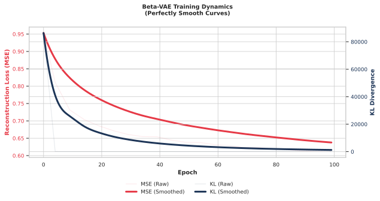
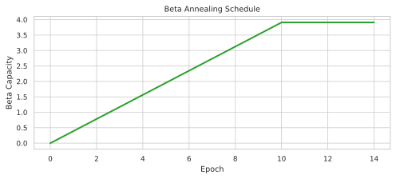
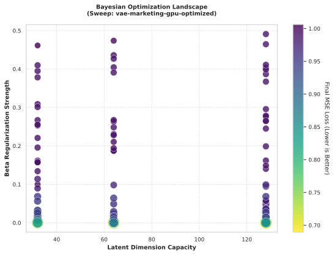

# VAE Marketing Impact Analysis

This repository contains a production-ready machine learning pipeline based on Variational Autoencoders (VAE) to quantify the impact of marketing stimuli on consumer behavior using the Dunnhumby dataset.

## Core Capabilities

- **Unsupervised Behavior Profiling**: Learns deep latent representations of household spending habits.
- **Disentangled Factor Analysis (Beta-VAE)**: Breaks down behavioral shifts into independent, interpretable factors (e.g., price sensitivity vs. volume).
- **Quantifiable Impact**: Measures behavioral deviation using Euclidean distance in latent space.
- **Experiment Tracking**: Full integration with Weights & Biases (WandB) for metrics, model versioning, and HPO.

## Tech Stack

- **Python 3.11+**
- **Deep Learning**: PyTorch
- **Data Engineering**: Polars (high-performance processing), Pandas, PyArrow (Parquet)
- **Tracking & HPO**: Weights & Biases (WandB)
- **Metrics**: Scikit-learn (MIG, SAP, R² scores)

---

## Installation & Setup

### Local Environment
```bash
# Install dependencies
pip install polars pandas torch wandb pyarrow scikit-learn tabulate
```

### Google Colab (HPO Mode)
For large-scale hyperparameter searches, use our Colab-optimized setup:
1. Clone the repo.
2. Run `!pip install polars pandas torch wandb pyarrow scikit-learn tabulate`.
3. Use `wandb.login()` and run the sweep agent as described in the **Hyperparameter Optimization** section.

---

## Usage Guide

### 🧑‍💼 For Business & Marketing Users
If you are evaluating this project for business impact, please start here:
- **[Marketing User Guide](docs/MARKETING_GUIDE.md)**: How this tool replaces traditional A/B testing.
- **[Sample Impact Report](docs/SAMPLE_REPORT.md)**: An example of the actionable insights generated by the model.

---

### 💻 For Engineers & Data Scientists

#### 1. Data Preparation
Transform raw Dunnhumby CSVs into memory-efficient Parquet files with rolling window aggregations and cyclical temporal encodings.
```bash
PYTHONPATH=. python3 src/data/prepare.py \
    --input-transactions data/transaction_data.csv \
    --input-products data/product.csv \
    --output-dir data/processed_full \
    --train-weeks 72 \
    --val-weeks 14
```

### 2. Model Training
Train a disentangled Beta-VAE with configurable annealing.
```bash
PYTHONPATH=. python3 main.py train \
    --arch beta_vae \
    --data data/processed_full/train.parquet \
    --vocab data/processed_full/vocabulary.json \
    --latent-dim 32 \
    --beta 2.0 \
    --anneal-end 5 \
    --lr 0.001 \
    --wandb
```

### 3. Impact Inference
Quantify behavioral shifts in a target period (e.g., test set or campaign period) compared to a baseline.
```bash
PYTHONPATH=. python3 main.py infer \
    --run-id full-beta-vae-32d \
    --data data/processed_full/test.parquet \
    --baseline data/processed_full/train.parquet \
    --limit 100
```
*Outputs: Console summary + `experiments/[run_id]/inference_report.json` with factor breakdowns.*

### 4. Hyperparameter Optimization (WandB Sweeps)
Automate the search for optimal `beta`, `latent-dim`, and `learning-rate`.
1. Initialize the sweep: `wandb sweep sweep.yaml`
2. Start the agent: `wandb agent <ENTITY>/vae_marketing/<SWEEP_ID>`

#### Example Training Dynamics (Beta-VAE)
The model effectively balances reconstruction fidelity (MSE Loss) with latent space regularization (KL Divergence) over a carefully tuned annealing schedule.





#### Bayesian Optimization Landscape
Bayesian search results showing the relationship between Latent Dimension, Beta Regularization, and the final Reconstruction Loss.




---

## Project Structure

- `src/data/`: Data preparation pipeline (extractors, normalizers).
- `src/models/`: Architecture definitions (Baseline VAE, Beta-VAE, Factory).
- `src/services/`: Core logic for impact analysis and reporting.
- `src/utils/`: Shared utilities for metrics, logging, and reproducibility.
- `specs/`: Technical specifications for each development stage.
- `experiments/`: Artifacts, configs, and JSON reports for every run.

## Metrics & Validation
- **MIG (Mutual Information Gap)**: Measures latent factor independence.
- **SAP (Separated Attribute Predictability)**: Validates factor-to-attribute alignment.
- **MSE**: Tracks reconstruction fidelity.
- **Latent Deviation**: Real-world magnitude of behavior change.

---
*Developed for Stage 003: Disentangled VAE for Marketing Impact Analysis.*
